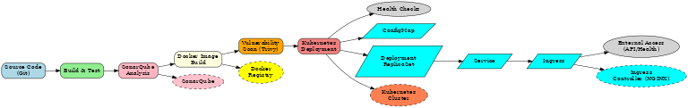

# Spring Boot Kubernetes CI/CD Pipeline Project

This repository showcases a complete CI/CD pipeline designed for a Spring Boot application running on Kubernetes. The project incorporates Docker, Kubernetes, Jenkins, and SonarQube for efficient build, test, and deployment workflows.

---
## CI/CD Pipeline Architecture

The diagram below provides an overview of the CI/CD workflow and Kubernetes deployment process for this project:



## Table of Contents

1. [Overview](#overview)
2. [Technologies Used](#technologies-used)
3. [Setup Instructions](#setup-instructions)
4. [CI/CD Pipeline Workflow](#cicd-pipeline-workflow)
5. [Kubernetes Deployment](#kubernetes-deployment)
6. [Testing and Validation](#testing-and-validation)
7. [Future Enhancements](#future-enhancements)
8. [Contributing](#contributing)
9. [License](#license)

---

## Overview

This project demonstrates the deployment of a Spring Boot application in a Kubernetes cluster with a fully functional CI/CD pipeline using Jenkins. Key features include:

- Automated build and test process.
- SonarQube analysis for code quality.
- Docker image creation and vulnerability scanning with Trivy.
- Deployment to a Kubernetes cluster.
- Integrated health checks using Kubernetes liveness probes.

---

## Technologies Used

- **Spring Boot**: Framework for the application.
- **Jenkins**: CI/CD automation.
- **SonarQube**: Code quality and security analysis.
- **Docker**: Containerization of the application.
- **Trivy**: Vulnerability scanning for Docker images.
- **Kubernetes**: Container orchestration and deployment.
- **NGINX Ingress**: Routing HTTP traffic to the application.

---

## Setup Instructions

1. **Clone the Repository**:
   ```bash
   git clone https://github.com/your-repo/spring-k8s-cicd
   cd spring-k8s-cicd
   ```

2. **Install Dependencies**:
   - Docker
   - Kubernetes CLI (`kubectl`)
   - Jenkins (with required plugins)
   - SonarQube Server

3. **Set Up Kubernetes Cluster**:
   Ensure you have a running Kubernetes cluster. Use tools like `minikube`, `kind`, or a managed Kubernetes service.

4. **Apply Kubernetes Manifests**:
   ```bash
   kubectl apply -f k8s/base/
   ```

5. **Configure Jenkins Pipeline**:
   - Create a Jenkins pipeline and link it to this repository.
   - Add the following credentials in Jenkins:
     - `k8s-config`: Kubernetes configuration.
     - `sonar-token`: Token for SonarQube authentication.

6. **Run the Pipeline**:
   Trigger the Jenkins pipeline to build, test, and deploy the application.

---

## CI/CD Pipeline Workflow

1. **Checkout**: Jenkins pulls the source code from the repository.
2. **Build & Test**: Runs Maven to build the application and execute unit tests.
3. **SonarQube Analysis**: Analyzes the codebase for quality and security.
4. **Docker Image Build**: Creates a Docker image tagged with the build number.
5. **Security Scan**: Uses Trivy to scan the image for vulnerabilities.
6. **Kubernetes Deployment**: Deploys the application to the Kubernetes cluster and validates the deployment using health checks.

---

## Kubernetes Deployment

The application is deployed with the following Kubernetes resources:

- **ConfigMap**: Stores application configuration.
- **Deployment**: Manages application pods.
- **Service**: Exposes the application within the cluster.
- **Ingress**: Routes external traffic to the application.

---

## Testing and Validation

1. **Verify Pods**:
   ```bash
   kubectl get pods
   ```

2. **Check Application Logs**:
   ```bash
   kubectl logs deployment/spring-k8s-app
   ```

3. **Health Check**:
   Port-forward to access the application locally:
   ```bash
   kubectl port-forward service/spring-k8s-service 8081:80
   curl http://localhost:8081/api/health
   ```

4. **Ingress Validation**:
   Ensure that the ingress routes traffic correctly:
   ```bash
   kubectl describe ingress spring-k8s-ingress
   ```

---

## Future Enhancements

- Add a staging environment for deployments.
- Implement blue-green or canary deployment strategies.
- Integrate monitoring tools like Prometheus and Grafana.

---

## Contributing

Contributions are welcome! Please submit a pull request or open an issue to discuss your ideas.

---

## License

This project is licensed under the MIT License. See the `LICENSE` file for details.

